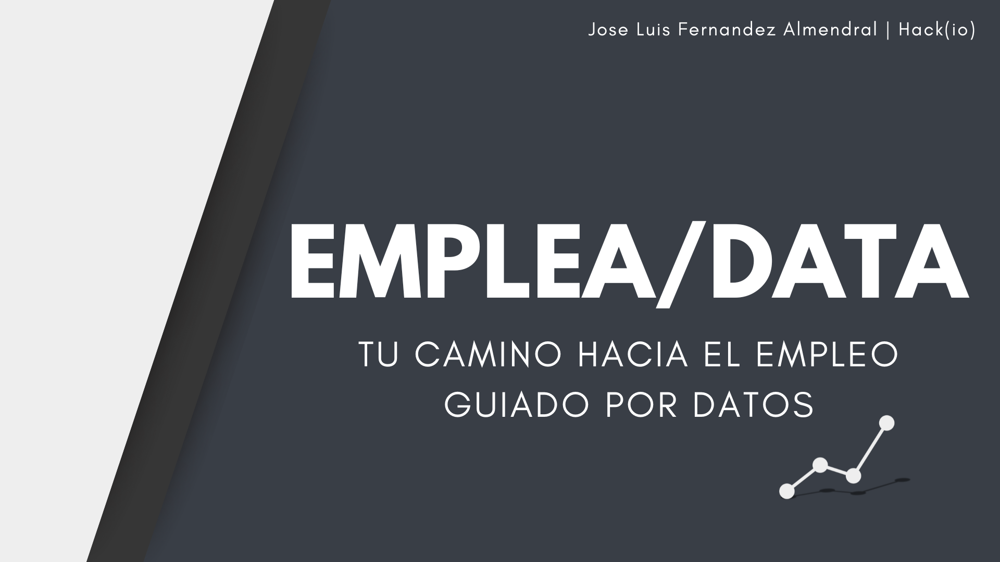

# Proyecto Final de Máster: Análisis del Mercado Laboral en el Mundo del Data

## Descripción del Proyecto

Este proyecto busca resolver uno de los principales retos a los que se enfrentan los profesionales en el ámbito de los datos: entender el mercado laboral y las demandas actuales de manera clara, rápida y efectiva. La plataforma que se está desarrollando permitirá a los usuarios identificar los puestos más demandados, las habilidades necesarias para cada rol, y las ofertas laborales que mejor se ajusten a su perfil.

Actualmente, el proyecto se encuentra en **fase de desarrollo**.

## Objetivos Principales

1. **Ahorro de tiempo**: Reducir el esfuerzo requerido para buscar y comparar ofertas laborales.
2. **Claridad del mercado laboral**: Proporcionar una visión clara y actualizada sobre los puestos y habilidades más demandados.
3. **Personalización**: Ofrecer resultados personalizados basados en las habilidades y experiencia del usuario.
4. **Clasificación precisa de roles**: Identificar roles laborales más allá de los nombres ambiguos en las ofertas.

## Funcionalidades Previstas

- Subida de CV o ingreso manual de habilidades y experiencia.
- Consultas sobre:
  - Puestos laborales más demandados.
  - Habilidades clave por cada puesto.
- Reportes personalizados:
  - Análisis de habilidades actuales del usuario y sugerencias para mejorar su empleabilidad.
  - Ofertas laborales relevantes basadas en el perfil del usuario.
- Validación de ofertas laborales para ayudar a recursos humanos a redactar descripciones precisas y efectivas.

## Tecnologías y Herramientas

- **Base de datos**: MongoDB Atlas.
- **Framework de desarrollo web**: Streamlit.
- **Scraping de datos**:
  - Scrapy con Playwright o Puppeteer (para datos específicos).
  - Automatización con Apache Airflow.
- **Datos iniciales**: Generados sintéticamente a partir de ofertas reales en plataformas como LinkedIn e InfoJobs.

## Estado Actual

El proyecto está en desarrollo y se encuentra en una fase de prototipado inicial. Las funcionalidades están siendo implementadas de forma iterativa para garantizar una experiencia de usuario óptima.

## Futuro del Proyecto

Se planea incluir:
- Simulaciones de mejoras en el perfil del usuario y cómo impactarían en las ofertas disponibles.
- Extensiones para capturar datos en tiempo real de plataformas laborales de forma legal y ética.
- Opciones avanzadas de personalización y almacenamiento de datos mediante cuentas de usuario.

---

**Autor**: José Luis Fernández Almendral

¡Gracias por tu interés en este proyecto!
